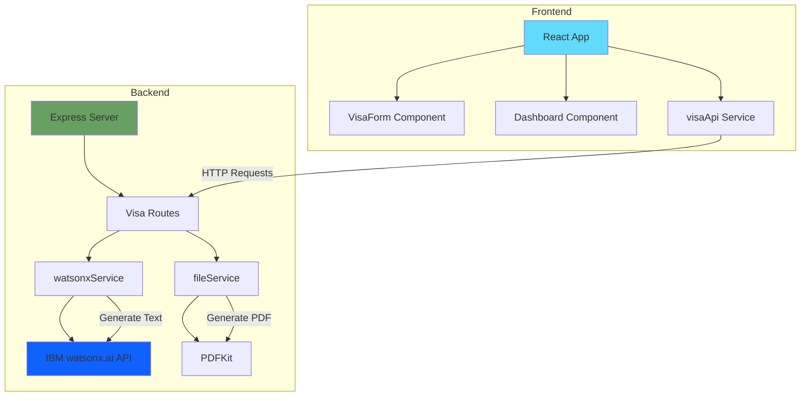
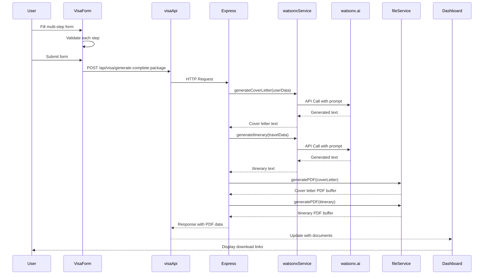

# Agentic VISA Assistant System - Project Plan

## Project Overview
A full-stack application that helps travelers generate necessary visa documentation (cover letters and itineraries) using IBM watsonx.ai's meta-llama/llama-3-3-70b-instruct model.

## Architecture Overview



## Technology Stack

### Backend
- **Runtime**: Node.js (v18+)
- **Framework**: Express.js
- **AI Integration**: IBM watsonx.ai SDK (@ibm-cloud/watsonx-ai)
- **PDF Generation**: pdfkit
- **HTTP Client**: axios (for watsonx.ai API calls)
- **Environment**: dotenv
- **CORS**: cors middleware

### Frontend
- **Framework**: React 18+
- **Build Tool**: Vite
- **HTTP Client**: axios
- **UI Components**: React hooks for state management
- **Styling**: CSS Modules or Tailwind CSS (to be decided)

## Project Structure

```
agentic-visa-assistant/
├── backend/
│   ├── server.js                 # Express server entry point
│   ├── routes/
│   │   └── visa.js              # Visa document generation routes
│   ├── services/
│   │   ├── watsonxService.js    # watsonx.ai integration
│   │   └── fileService.js       # PDF generation service
│   ├── config/
│   │   └── watsonx.js           # watsonx.ai configuration
│   ├── utils/
│   │   └── prompts.js           # AI prompt templates
│   ├── .env.example             # Environment variables template
│   ├── .env                     # Environment variables (gitignored)
│   └── package.json
│
├── frontend/
│   ├── src/
│   │   ├── components/
│   │   │   ├── VisaForm.jsx     # Multi-step form component
│   │   │   └── Dashboard.jsx    # Document tracking dashboard
│   │   ├── api/
│   │   │   └── visaApi.js       # Backend API client
│   │   ├── hooks/
│   │   │   └── useVisaForm.js   # Custom hook for form state
│   │   ├── utils/
│   │   │   └── validation.js    # Form validation utilities
│   │   ├── App.jsx              # Main app component
│   │   └── main.jsx             # React entry point
│   ├── public/
│   ├── index.html
│   ├── vite.config.js
│   └── package.json
│
├── AGENTS.md                     # Project context for Bob sessions
├── README.md                     # Setup and usage instructions
└── .gitignore
```

## Component Specifications

### Backend Components

#### 1. server.js
**Purpose**: Express server initialization and configuration
**Key Features**:
- Express app setup with JSON body parser
- CORS configuration for frontend communication
- Route mounting
- Error handling middleware
- Server startup on port 3001

#### 2. routes/visa.js
**Purpose**: API endpoints for visa document generation
**Endpoints**:
- `POST /api/visa/generate-cover-letter` - Generate cover letter
- `POST /api/visa/generate-itinerary` - Generate travel itinerary
- `POST /api/visa/generate-complete-package` - Generate both documents

**Request Body Schema**:
```json
{
  "personalInfo": {
    "fullName": "string",
    "nationality": "string",
    "passportNumber": "string",
    "dateOfBirth": "string"
  },
  "travelInfo": {
    "destination": "string",
    "purpose": "string",
    "duration": "number",
    "departureDate": "string",
    "returnDate": "string"
  },
  "additionalInfo": {
    "occupation": "string",
    "employer": "string",
    "accommodations": "string",
    "previousVisits": "boolean"
  }
}
```

#### 3. services/watsonxService.js
**Purpose**: IBM watsonx.ai integration for text generation
**Key Functions**:
- `generateCoverLetter(userData)` - Generate personalized cover letter
- `generateItinerary(travelData)` - Generate detailed travel itinerary
- `callWatsonxAPI(prompt, parameters)` - Core API interaction

**watsonx.ai Configuration**:
- Model: `meta-llama/llama-3-3-70b-instruct`
- Parameters:
  - max_new_tokens: 1000
  - temperature: 0.7
  - top_p: 0.9
  - repetition_penalty: 1.1

**Prompt Engineering Strategy**:
- System prompts for document formatting
- Context injection with user data
- Structured output formatting
- Professional tone enforcement

#### 4. services/fileService.js
**Purpose**: PDF document generation using pdfkit
**Key Functions**:
- `generatePDF(content, metadata)` - Create PDF from text content
- `formatCoverLetter(text)` - Format cover letter with proper styling
- `formatItinerary(text)` - Format itinerary with sections
- `addHeader(doc, title)` - Add document header
- `addFooter(doc, pageNumber)` - Add page footer

**PDF Styling**:
- Professional fonts (Helvetica, Times)
- Proper margins and spacing
- Header with document title
- Footer with page numbers
- Sections with clear hierarchy

### Frontend Components

#### 1. VisaForm.jsx
**Purpose**: Multi-step form for collecting user data
**Steps**:
1. Personal Information (name, nationality, passport, DOB)
2. Travel Details (destination, purpose, dates, duration)
3. Additional Information (occupation, employer, accommodations)
4. Review and Submit

**Features**:
- Step navigation (Next, Previous, Submit)
- Form validation at each step
- Progress indicator
- Data persistence in component state
- Error handling and display

**State Management**:
```javascript
{
  currentStep: number,
  formData: {
    personalInfo: {},
    travelInfo: {},
    additionalInfo: {}
  },
  errors: {},
  isSubmitting: boolean
}
```

#### 2. Dashboard.jsx
**Purpose**: Display and manage generated documents
**Features**:
- List of generated documents (session-based, no persistence)
- Document preview
- Download buttons for PDFs
- Generation status indicators
- Error messages for failed generations

**Display Information**:
- Document type (Cover Letter / Itinerary / Complete Package)
- Generation timestamp
- Traveler name
- Destination
- Download action

#### 3. api/visaApi.js
**Purpose**: Centralized API client for backend communication
**Functions**:
- `generateCoverLetter(formData)` - POST to cover letter endpoint
- `generateItinerary(formData)` - POST to itinerary endpoint
- `generateCompletePackage(formData)` - POST to complete package endpoint

**Features**:
- Axios instance with base URL configuration
- Request/response interceptors
- Error handling and transformation
- Loading state management

## Data Flow

### Document Generation Flow



## Environment Configuration

### Backend (.env)
```env
# Server Configuration
PORT=3001
NODE_ENV=development

# IBM watsonx.ai Configuration
WATSONX_API_KEY=your_ibm_cloud_api_key
WATSONX_PROJECT_ID=your_project_id
WATSONX_URL=https://us-south.ml.cloud.ibm.com

# CORS Configuration
FRONTEND_URL=http://localhost:5173
```

### Frontend (.env)
```env
VITE_API_BASE_URL=http://localhost:3001
```

## API Prompt Templates

### Cover Letter Prompt Template
```
You are a professional visa application assistant. Generate a formal cover letter for a visa application with the following details:

Applicant Information:
- Full Name: {fullName}
- Nationality: {nationality}
- Passport Number: {passportNumber}
- Date of Birth: {dateOfBirth}
- Occupation: {occupation}
- Employer: {employer}

Travel Information:
- Destination: {destination}
- Purpose: {purpose}
- Duration: {duration} days
- Departure Date: {departureDate}
- Return Date: {returnDate}
- Accommodations: {accommodations}

Requirements:
1. Use formal business letter format
2. Address to "Visa Officer" at the embassy
3. Include clear statement of purpose
4. Mention financial capability and ties to home country
5. Express commitment to comply with visa regulations
6. Keep length between 300-500 words
7. Use professional and respectful tone

Generate the complete cover letter now:
```

### Itinerary Prompt Template
```
You are a professional travel planner. Generate a detailed day-by-day travel itinerary for a visa application with the following details:

Travel Information:
- Destination: {destination}
- Purpose: {purpose}
- Duration: {duration} days
- Departure Date: {departureDate}
- Return Date: {returnDate}
- Accommodations: {accommodations}

Requirements:
1. Create day-by-day breakdown from departure to return
2. Include specific activities relevant to the purpose
3. Mention accommodation details for each location
4. Include transportation between locations
5. Add estimated times for major activities
6. Keep it realistic and visa-officer friendly
7. Format with clear date headers and bullet points

Generate the complete itinerary now:
```

## Development Workflow

### Phase 1: Backend Setup
1. Initialize Node.js project
2. Install dependencies (express, cors, dotenv, axios, pdfkit, @ibm-cloud/watsonx-ai)
3. Create server.js with basic Express setup
4. Implement watsonxService.js with API integration
5. Implement fileService.js with PDF generation
6. Create visa routes with all endpoints
7. Test API endpoints with Postman/Thunder Client

### Phase 2: Frontend Setup
1. Initialize React project with Vite
2. Install dependencies (react, react-dom, axios)
3. Create VisaForm.jsx with multi-step logic
4. Create Dashboard.jsx for document display
5. Implement visaApi.js for backend communication
6. Add form validation and error handling
7. Style components for professional appearance

### Phase 3: Integration & Testing
1. Connect frontend to backend APIs
2. Test complete document generation flow
3. Verify PDF downloads work correctly
4. Test error scenarios and edge cases
5. Optimize watsonx.ai prompts for better output
6. Add loading states and user feedback

### Phase 4: Documentation & Deployment
1. Create comprehensive AGENTS.md
2. Write detailed README.md
3. Add inline code comments
4. Create .env.example files
5. Test deployment process
6. Document known issues and limitations

## Technical Considerations

### watsonx.ai Integration
- **Authentication**: IBM Cloud IAM API key
- **Rate Limiting**: Implement request throttling if needed
- **Error Handling**: Graceful fallbacks for API failures
- **Prompt Optimization**: Iterative refinement for quality output
- **Token Management**: Monitor token usage for cost control

### PDF Generation
- **Memory Management**: Stream PDFs for large documents
- **Formatting**: Consistent styling across documents
- **File Size**: Optimize for reasonable file sizes
- **Encoding**: UTF-8 support for international characters

### Frontend UX
- **Loading States**: Clear feedback during generation
- **Error Messages**: User-friendly error descriptions
- **Validation**: Real-time form validation
- **Responsiveness**: Mobile-friendly design
- **Accessibility**: ARIA labels and keyboard navigation

### Security Considerations
- **API Keys**: Never expose in frontend code
- **Input Validation**: Sanitize all user inputs
- **CORS**: Restrict to known frontend origin
- **Rate Limiting**: Prevent abuse of generation endpoints
- **File Handling**: Secure PDF generation and delivery

## Success Criteria

### Functional Requirements
- ✓ Multi-step form collects all required user data
- ✓ watsonx.ai generates professional cover letters
- ✓ watsonx.ai generates detailed itineraries
- ✓ PDFs are properly formatted and downloadable
- ✓ Dashboard displays generated documents
- ✓ Error handling provides clear feedback

### Non-Functional Requirements
- ✓ Document generation completes within 30 seconds
- ✓ UI is responsive and intuitive
- ✓ Code is well-documented and maintainable
- ✓ Environment variables properly configured
- ✓ AGENTS.md provides clear project context

## Future Enhancements (Out of Scope)
- Database integration for request history
- User authentication and multi-user support
- Document templates and customization
- Email delivery of generated documents
- Support for additional document types
- Multi-language support
- Payment integration for premium features

## Dependencies

### Backend Dependencies
```json
{
  "express": "^4.18.2",
  "cors": "^2.8.5",
  "dotenv": "^16.3.1",
  "axios": "^1.6.0",
  "pdfkit": "^0.13.0",
  "@ibm-cloud/watsonx-ai": "^1.0.0"
}
```

### Frontend Dependencies
```json
{
  "react": "^18.2.0",
  "react-dom": "^18.2.0",
  "axios": "^1.6.0"
}
```

### Development Dependencies
```json
{
  "nodemon": "^3.0.1",
  "vite": "^5.0.0",
  "@vitejs/plugin-react": "^4.2.0"
}
```

## Estimated Timeline
- Backend Setup: 4-6 hours
- Frontend Setup: 4-6 hours
- Integration & Testing: 3-4 hours
- Documentation: 2-3 hours
- **Total**: 13-19 hours

## Risk Assessment

### High Risk
- watsonx.ai API availability and response quality
- PDF generation complexity for formatted documents

### Medium Risk
- Form validation edge cases
- CORS configuration issues
- Environment variable management

### Low Risk
- React component structure
- Express routing setup
- Basic styling implementation

## Next Steps
1. Review and approve this plan
2. Set up development environment
3. Obtain IBM Cloud API credentials
4. Begin Phase 1: Backend Setup
5. Switch to Code mode for implementation